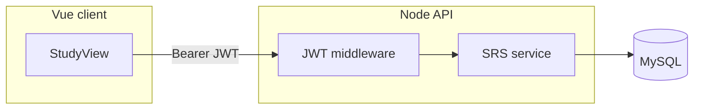

# Бэкенд: auth, MySQL, интервальное повторение, Docker

## Контекст репозитория

- Фронтенд: Vue 3 + Vite (`[package.json](package.json)`), типы карточки/колоды в `[src/types/index.ts](src/types/index.ts)`, изучение — `[src/views/StudyView.vue](src/views/StudyView.vue)` (сейчас случайная очередь без SRS).
- Данных на сервере нет; Docker-файлов нет.

## Структура монорепозитория

- Каталог `**server/**` (или `backend/`) — отдельный `package.json`, сборка `tsc`, точка входа `src/index.ts`.
- В корне: `**docker-compose.yml**` — сервисы `mysql` и `api` (образ из `server/Dockerfile` или build context `./server`).
- Переменные окружения: `DATABASE_URL` / хост, порт, пользователь, пароль, `JWT_SECRET`, порт HTTP (например `3000`).

## Стек (рекомендация)

| Область   | Выбор                                                                                     |
| --------- | ----------------------------------------------------------------------------------------- |
| HTTP      | **Fastify** или Express — минимальный бойлерплейт, хорошая типизация                      |
| БД        | **mysql2** + миграции (**Drizzle** или **Knex**) — схема в коде, воспроизводимые миграции |
| Пароли    | **bcrypt** (cost 10–12)                                                                   |
| Токены    | **JWT** (access), срок жизни в конфиге                                                    |
| Валидация | **Zod** для body/query                                                                    |

Альтернатива: Prisma + MySQL — удобно, но тяжелее; для явного SQL подойдут Drizzle/Knex.

## Схема MySQL (логическая)

- `**users`**: `id`, `email` (unique), `password_hash`, `created_at`.
- `**decks`**: `id`, `user_id`, `name`, `created_at` — соответствует `[Deck](src/types/index.ts)` без вложенных карточек в строке.
- `**cards`**: `id`, `deck_id`, `hanzi`, `pinyin`, `meaning`, `example`, `notes` (nullable), `created_at`.
- `**card_progress`** (одна строка на пару пользователь–карточка):  
  - `user_id`, `card_id` (unique вместе)  
  - `**status`**: `not_started` | `learning` | `learned` (маппинг на «Не изучено» / «В процессе» / «Изучено»)  
  - `**step**`: номер успешного этапа 0…11 (0 = ещё не было «Знаю» или только добавлена; после 11-го «Знаю» → learned)  
  - `**first_shown_at**`: время **первого** показа карточки в квизе (для якоря шагов 7–11)  
  - `**next_due_at`**: когда карточку снова показывать  
  - `**last_review_at`**, при необходимости `**last_result`** (know / dont_know) для отладки.

Индексы: `(user_id, next_due_at)` для выборки очереди; FK на `cards`/`decks` с каскадом по смыслу (удаление колоды — удаление карточек и прогресса).

## Алгоритм интервалов (реализация на сервере)

Зафиксированные правила:

**Шаги 2–6** — от **последнего** «Знаю» (цепочка после успешного ответа):

- После 1-го «Знаю»: следующий показ через **30 мин**  
- После 2-го: **+1 ч**  
- После 3-го: **+2 ч**  
- После 4-го: **+4 ч**  
- После 5-го: **+8 ч**

**Шаги 7–11** — от **первого показа** карточки (выбрано вами: якорь `first_shown_at`):

- 7: **+1 сутки** от `first_shown_at`  
- 8: **+3 суток** от `first_shown_at`  
- 9: **+7 суток**  
- 10: **+14 суток**  
- 11: **+30 суток** (месяц как календарный интервал или 30×24ч — зафиксировать одну конвенцию в коде)

При переходе на шаг 7+ после шага 6 выставлять `next_due_at = max(рассчитанный_якорный_срок, now)` если пользователь отстаёт, чтобы не ломать порядок шагов.

**После 11-го «Знаю»**: `status = learned`, дальше `**next_due_at = last_know_at + 1 месяц`** (та же конвенция «месяц», что и выше).

**Первый показ**: при добавлении карточки или при первом включении в очередь — `first_shown_at` задаётся при первом фактическом показе; `next_due_at` = сразу (карточка в очереди «новая»).

**«Не знаю»** (не описано в ТЗ): заложить в сервисе политику по умолчанию — например **не увеличивать `step`**, сдвиг `next_due_at` на короткий интервал (10–15 мин) или в конец сессии; вынести константы в конфиг, чтобы поменять без смены схемы.

## API (черновой контракт)

- `POST /auth/register`, `POST /auth/login` → JWT + базовые данные пользователя.
- `GET /auth/me` — защищённый.
- CRUD **колод** и **карточек** под пользователем (проверка `deck.user_id = auth.user_id`).
- `**GET /study/decks/:deckId/queue`** (или query-параметры): карточки с `next_due_at <= now` и нужным `status`, с лимитом; опционально смешивание с «новыми» без прогресса.
- `**POST /study/review`**: `{ cardId, result: "know" | "dont_know" }` — атомарное обновление `card_progress`, пересчёт `step`, `next_due_at`, `status`.

CORS для dev: origin фронта (Vite `localhost:5173`). Заголовок `Authorization: Bearer <jwt>`.

## Docker Compose

- Образ **MySQL 8** с volume для данных, healthcheck, переменные `MYSQL_DATABASE`, `MYSQL_USER`, `MYSQL_PASSWORD`, `MYSQL_ROOT_PASSWORD`.
- Сервис **api**: build из `./server`, `depends_on` с условием готовности MySQL, проброс порта, `env_file` или `environment` из `.env.example`.
- Скрипт миграций при старте контейнера (`npm run migrate` в CMD/entrypoint) или отдельная job — главное, чтобы миграции применялись до приёма трафика.

Файлы: `[docker-compose.yml](docker-compose.yml)` в корне, `[server/Dockerfile](server/Dockerfile)`, `[.dockerignore](.dockerignore)` для `node_modules`.

## Связка с текущим фронтом (вне scope этого бэкенда, но логичный follow-up)

- Заменить/дополнить `[src/lib/storage.ts](src/lib/storage.ts)` вызовами API при наличии токена.
- `StudyView`: очередь с сервера + отправка `review` после «Знаю»/«Не знаю» (потребуется UI-кнопки вместо только «следующая карточка»).

## Тестирование и качество

- Юнит-тесты на **чистую функцию** расчёта `next_due_at` / смены `step` (без БД) — покрыть границы шагов 6→7 и 11→learned, отставание пользователя от якоря 7–11.
- Опционально: e2e один сценарий с supertest + тестовая БД.

## Документация

- Краткий блок в `[README.md](README.md)`: как поднять `docker compose up`, переменные, как дернуть регистрацию/логин (без раздувания — только то, что нужно для запуска).

