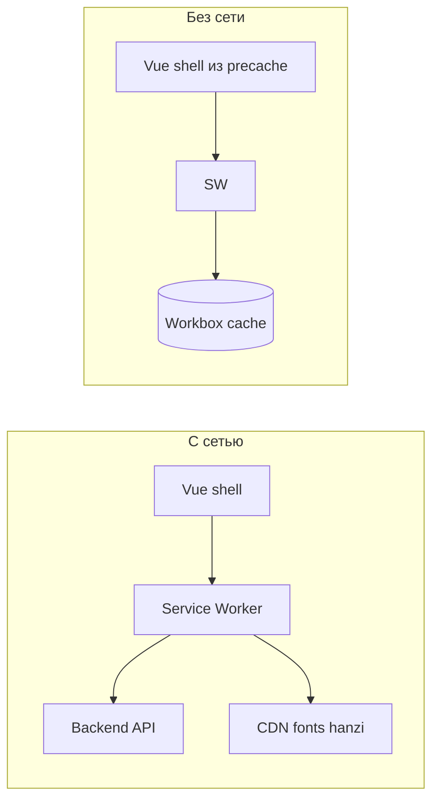

# PWA: установка на экран и офлайн

## Текущее состояние

- В [index.html](index.html) уже подключены `manifest`, `apple-touch-icon`, `theme-color`.
- [public/site.webmanifest](public/site.webmanifest) задаёт `name`, `short_name`, `display: standalone`, иконки 192/512.
- Сборка: [vite.config.ts](vite.config.ts) с `base: './'` (важно для `scope`/`start_url` при деплое в подкаталог).
- Роутер — [hash history](src/router/index.ts) (`createWebHashHistory`), что удобно для SPA-офлайна: достаточно отдать кэшированный `index.html` при первом заходе.
- **Service Worker в проекте нет** — критично для критериев установки в Chrome и для кэша оболочки.

Данные колод/SRS идут через `[apiRequest](src/lib/api/client.ts)` на бэкенд; полноценная работа без сети для этих сценариев без отдельного слоя синхронизации невозможна. Реалистичная цель «по возможности»: **офлайн открывается UI**, ранее посещённые **статические** запросы (шрифты, [hanzi-writer-data с jsdelivr](src/lib/charDataLoader.ts), [модели почерка](src/composables/useHandwritingRecognizer.ts)) могут отдаваться из кэша после первого успешного загрузочного сеанса.

## Подход

### 1. Service Worker и кэш — `vite-plugin-pwa`

- Добавить dev-зависимость `**vite-plugin-pwa`** и подключить в [vite.config.ts](vite.config.ts).
- Режим `**generateSW**` (Workbox из коробки): автоматический **precache** всех артефактов прод-сборки (JS/CSS/chunks, `index.html`).
- В `workbox.runtimeCaching` добавить правила (например `StaleWhileRevalidate` или `CacheFirst` с лимитом записей/срока):
  - `https://fonts.googleapis.com/*` и `https://fonts.gstatic.com/*` (см. [index.html](index.html)).
  - `https://cdn.jsdelivr.net/*` (данные черт и модели распознавания).
- Настроить `**navigateFallback`**: `'index.html'` (или эквивалент с учётом `base`), с `**navigateFallbackDenylist**`, включающим `/api`**, чтобы запросы к API не подменялись HTML-заглушкой при ошибках сети.
- В [src/main.ts](src/main.ts) зарегистрировать SW через виртуальный модуль `virtual:pwa-register` (например `registerType: 'autoUpdate'` — тихое обновление при новой сборке).

Манифест лучше **вести из конфига плагина** (один источник правды): перенести поля из [public/site.webmanifest](public/site.webmanifest) в опцию `manifest` плагина и **убрать дублирующий** статический файл из `public/` (или оставить редирект/удалить ссылку из `index.html`, если плагин сам вставит `<link rel="manifest">` — избежать двойного манифеста).

### 2. Установка на главный экран (критерии и iOS)

- **Иконки в манифесте**: сейчас только `"purpose": "maskable"`. Для совместимости с разными платформами добавить те же файлы с `**purpose: "any"`** (или отдельные `any`-иконки), сохранив maskable для Android.
- Явно задать `**scope**` (согласованный с реальным URL приложения; при `base: './'` для корневого хоста — `/`, для подкаталога — путь деплоя).
- В [index.html](index.html) для iOS добавить при необходимости: `apple-mobile-web-app-capable`, `apple-mobile-web-app-title` (короткое имя как у `short_name`) — улучшает полноэкранный режим после «На экран Домой».

### 3. Ожидания по офлайну (продукт / README)

- Кратко зафиксировать: без сети **нельзя** логиниться и синхронизировать SRS; **можно** открыть установленное приложение и использовать функции, не требующие новых ответов API, если кэш уже прогрет (в т.ч. почерк после загрузки данных с CDN).

## Проверка после внедрения

- `npm run build && npm run preview` — в DevTools → Application: **Manifest** без ошибок, **Service worker** активен, **Install** доступен (Chrome).
- Офлайн: в Application → **Offline**, перезагрузка — главная/логин открываются; запросы к `/api` ведут себя предсказуемо (ошибка сети, без подмены на `index.html`).

## Файлы к изменению

| Файл                                               | Действие                                                            |
| -------------------------------------------------- | ------------------------------------------------------------------- |
| [package.json](package.json)                       | зависимость `vite-plugin-pwa`                                       |
| [vite.config.ts](vite.config.ts)                   | плагин, `manifest`, `workbox`                                       |
| [src/main.ts](src/main.ts)                         | регистрация SW                                                      |
| [index.html](index.html)                           | мета Apple, при необходимости убрать ручной `<link rel="manifest">` |
| [public/site.webmanifest](public/site.webmanifest) | удалить или заменить на генерацию из Vite (без дублирования)        |

Опционально позже (не входит в минимальный объём): баннер «Нет сети» через `navigator.onLine`, background sync — только если понадобится офлайн-очередь для API.