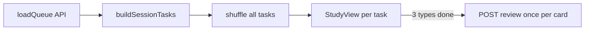

# План: тройной перемешанный квиз перед одним SRS-ответом

## Текущее состояние

- [StudyView.vue](src/views/StudyView.vue): очередь `StudyQueueItem[]`, одна позиция = одна карточка; лицо — **hanzi**, после переворота — pinyin/перевод/пример; опционально почерк через `requireHandwritingInStudy` и [HanziWriterQuiz.vue](src/components/HanziWriterQuiz.vue) (`showHintAfterMisses: 3`).
- SRS: один `POST /study/review` с `{ cardId, result }` на карточку — логика в [server/src/lib/srs/applyReview.ts](server/src/lib/srs/applyReview.ts), маршрут [server/src/routes/study.ts](server/src/routes/study.ts). Менять серверную SRS-математику **не нужно**, если оставить **один** `review` на завершённый цикл из трёх шагов.

## Целевое поведение (согласовано)

1. Для каждой карточки в сессии три **разных** задания: **RU** (`meaning`), **Hanzi** (только `hanzi`, без «ответа» с пиньинем на этом шаге — пиньинь можно не показывать или показать только после явного «ответа», по желанию UX), **Write** (посимвольный квиз; **без подсказок** — отдельная опция в `HanziWriterQuiz`).
2. Порядок трёх типов **не фиксирован**: для каждой карточки — случайная перестановка трёх типов, затем **общий** список заданий по всем карточкам перемешивается (Fisher–Yates), чтобы шаги разных слов чередовались случайно.
3. На шагах **RU** и **Hanzi** — кнопки «Знаю» / «Не знаю» (или эквивалент): ответ **не** вызывает `review`, а только выставляет флаг «в этой сессии по этой карточке было dont_know».
4. На шаге **Write** — после успешного `quiz` от HanziWriter — «Знаю»; отдельная кнопка «Не знаю» / сдача (если квиз не завершён) — тоже ставит тот же флаг.
5. Когда для карточки выполнены **все три типа** (независимо от порядка в общей очереди), один раз вызывается `studyApi.review` с `result: cardSessionFlag ? 'dont_know' : 'know'`.
6. После успешного `review` все **оставшиеся** задачи с тем же `cardId` в текущей сессии удаляются из очереди (на случай гонок или багов повторной вставки), индекс корректируется.

## Архитектура на клиенте

- Ввести тип, например `StudyTask = { card: ApiCard; kind: 'meaning' | 'hanzi' | 'write'; writeCharIndex?: number }`. Для многосимвольных слов шаг `write` уже разбит посимвольно (как сейчас `graphemes` + цикл) — это **один** логический тип «write» для карточки, пока не пройдены все символы; либо одна задача `write` с внутренним счётчиком символов (проще не плодить задачи в общем списке: **одна** запись в очереди на всю серию почерка для слова, внутри — `writeIndex` как сейчас).
- **Рекомендация по модели очереди**: элемент очереди = `{ cardId, kind, ... }` где `kind === 'write'` держит внутреннее состояние символов; `kind === 'meaning' | 'hanzi'` — один экран = одно продвижение индекса общей очереди.
- Структуры состояния сессии:
  - `sessionDontKnow = Set<number>` или `Map<cardId, boolean>` для флага «было не знаю»;
  - `sessionCompletedKinds: Map<cardId, Set<'meaning'|'hanzi'|'write'>>` — когда для `cardId` множество размера 3, вызвать `review`, затем `filter` очереди от остальных задач с этим `cardId`.

## Изменения по файлам

| Область            | Файлы                                                                                                                                                                                                                                                                | Действия                                                                                                                                                                                                                                                                                 |
| ------------------ | -------------------------------------------------------------------------------------------------------------------------------------------------------------------------------------------------------------------------------------------------------------------- | ---------------------------------------------------------------------------------------------------------------------------------------------------------------------------------------------------------------------------------------------------------------------------------------- |
| Настройка          | [server/src/db/schema.ts](server/src/db/schema.ts), миграция, [server/src/routes/auth.ts](server/src/routes/auth.ts), [src/lib/api/auth.ts](src/lib/api/auth.ts), [src/stores/auth.ts](src/stores/auth.ts), [src/views/SettingsView.vue](src/views/SettingsView.vue) | Новое поле пользователя, например `studyTripleMode` (tinyint), плюс описание в UI. Взаимодействие с `requireHandwritingInStudy`: при включённом тройном режиме текущий «переворот + опциональный почерк» не используется (в настройках кратко указать приоритет/взаимоисключение).       |
| Квиз без подсказок | [src/components/HanziWriterQuiz.vue](src/components/HanziWriterQuiz.vue)                                                                                                                                                                                             | Проп `showHintAfterMisses` (по умолчанию 3; в тройном режиме передавать значение, при котором HanziWriter не показывает подсказки — проверить типы в `hanzi-writer`; часто достаточно очень большого числа или опции из документации).                                                   |
| Сессия обучения    | [src/views/StudyView.vue](src/views/StudyView.vue) (или вынести в `src/composables/useStudyTaskQueue.ts`)                                                                                                                                                            | После `loadQueue`: если тройной режим — построить и перемешать задачи; иначе оставить текущую ветку. Рендер по `currentTask.kind`; прогресс «N / M» по **задачам**, не по карточкам. Кнопка «назад» — к предыдущей задаче с сбросом локального состояния шага почерка при необходимости. |
| API типов          | [src/lib/api/study.ts](src/lib/api/study.ts)                                                                                                                                                                                                                         | При необходимости экспортировать тип карточки для composable (уже есть `ApiCard`).                                                                                                                                                                                                       |

## Краевые случаи

- **Нет иероглифов для почерка** (`charsToWrite` пусто): не добавлять шаг `write` в тройку; SRS по-прежнему после двух шагов (RU + Hanzi), либо считать write выполненным автоматически — зафиксировать в коде одно правило (рекомендация: только два шага + один `review`).
- **Ошибка загрузки черт** (`loadError` из HanziWriter): трактовать как блокер шага write — показать сообщение и кнопку «Не знаю» / повтор, не зависая.
- **Пустая очередь после фильтрации**: как сейчас — догрузка или экран «нет карточек».

## Тесты

- Юнит-тест на чистую функцию «построить список задач + перемешать» (детерминированный seed в тесте): у каждой карточки ровно по одному `meaning`, `hanzi`, одному блоку `write` (или N символов внутри одной задачи).
- При желании: сценарий «после `review` все задачи с тем же cardId удалены».

## Что не делать в первой итерации

- Отдельные поля прогресса на сервере для «2 из 3 шагов» (достаточно клиентской сессии; при обновлении страницы пользователь заново получит очередь с сервера — приемлемый компромисс).
- Изменение SQL-очереди [buildStudyQueue](server/src/routes/study.ts) — очередь карточек остаётся как есть; перемешивание только на клиенте после ответа API.

